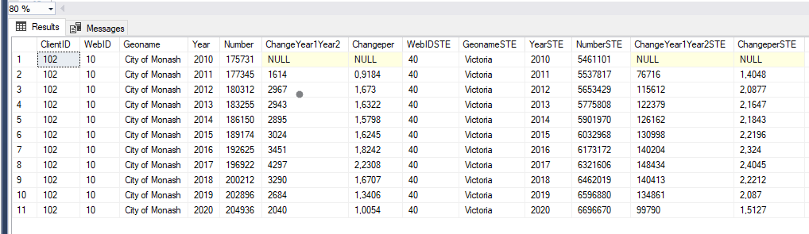

# Coding challenge for economy.id

Hi! please feel free to ask any question regarding the test if you have any doubts.

# Part 1 – Write a SQL Query

You’ll need to write a SQL function to query a table.

The data can be found in the [data folder](https://github.com/dotidconsulting/coding-challenge-economy/tree/main/part%201/data)

