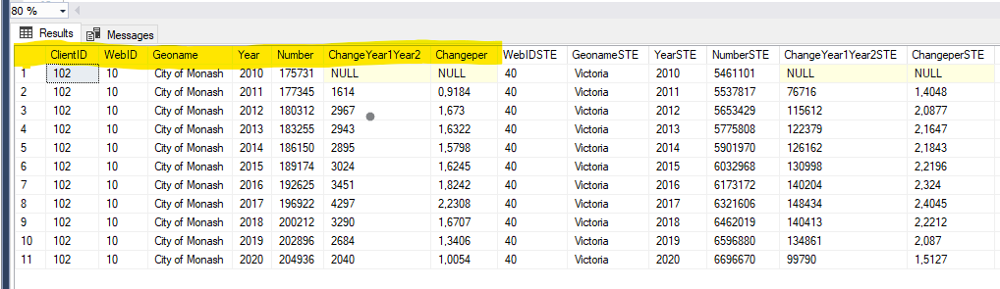

# Coding challenge for economy.id

Hi! please feel free to ask any question regarding the test if you have any doubts.

# Part 1 – Write a SQL Query

You’ll need to write a SQL function to query a table.

The data can be found in the [data folder](https://github.com/dotidconsulting/coding-challenge-economy/tree/main/part%201/data) of this repository and have the following schema:

- [ClientID] [int] 
- [WebID] [int] 
- [GeoName] [nvarchar] (200) 
- [Year] [int] 
- [Number] [float] 

### Requirements:
-	Put this data (v_IN_ERPPivot.csv) and your function into a database must be (any version of) SQL 
-	Commit your work to a GIT repository or provide a folder containing your DB

### Acceptance criteria:
-	build a SQL function to query that table so that the result of your query matches the first 7 columns in the screenshot below (in yellow), the rest of the table is optional but feel free to give it a go if you have some time!
-	The function accepts the following parameter: @ClientID int (102 in the example below)

> **hint:** the [ChangeYear1Year2] and [Changeper] columns needs to be created through the query. ChangeYear1Year2 is the difference between years (ie: for 2011, 1614 is the difference between 2010 and 2011 figures) Changeper is the same only expressed in percentage.

